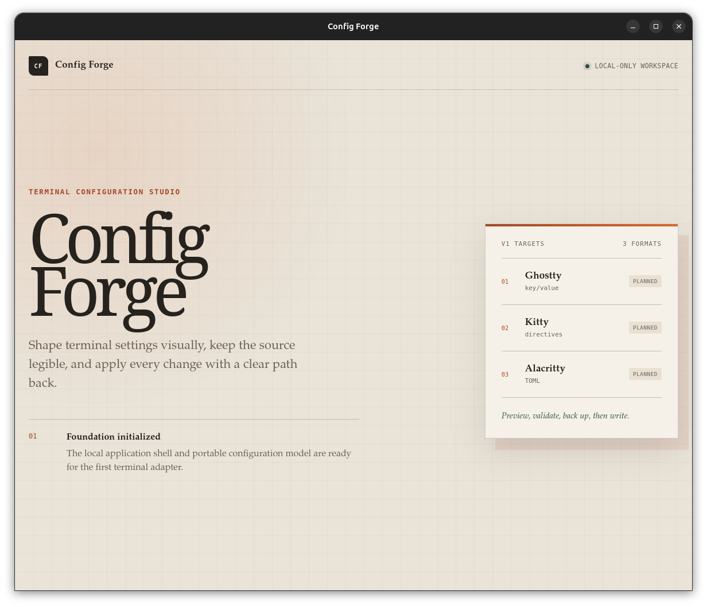

# Config Forge

Config Forge is a local-first Linux desktop application for creating,
importing, previewing, validating, translating, backing up, and safely applying
Ghostty, Kitty, and Alacritty configurations.

The current implementation includes:

- A Tauri 2 desktop shell with a React and TypeScript frontend.
- Strict type checking, ESLint, Prettier, Vitest, and Playwright.
- Portable configuration and project schemas for the three v1 terminals.
- Domain contracts for preserved document nodes, validation results, and
  recoverable application errors.
- SQLite migrations and repositories for projects and snapshots.
- Independently tested, structure-preserving adapters for Ghostty, Kitty, and
  Alacritty.
- A shared adapter registry and cross-terminal translation reports that
  classify every portable field as exact, omitted, or defaulted.
- Terminal and config path detection, atomic config writes with read-back
  verification, timestamped backups, and hybrid (internal + native) config
  validation, exposed as Tauri commands.

The completed checkpoint is Task 14: project/history services, safe-apply
orchestration, the responsive Home/Studio shell, visual controls, and the mock
terminal preview are implemented. Create and import open session-only drafts;
visual edits update generated source and internal validation. Controls show
native mapping and portability help and protect preserved unsupported values.
The preview is illustrative and executes no commands.

Development is paused after Task 14 at the user's request. Task 15 has not
started and is the next milestone when work resumes.

Save/Apply actions remain unavailable. Desktop database startup and most
project/history/file IPC commands are scheduled for Task 17. Advanced source
editing and review panels (Task 15) are next. See
`docs/project-status.md` for the exact implementation state and
`docs/config-forge-implementation-plan.md` for the complete roadmap.



## Prerequisites

- Node.js 20.19+ or 22.12+ and npm.
- Rust stable.
- The Linux packages listed in the
  [Tauri prerequisites guide](https://v2.tauri.app/start/prerequisites/).

On Ubuntu or Debian:

```bash
sudo apt update
sudo apt install -y \
  libwebkit2gtk-4.1-dev \
  build-essential \
  curl \
  wget \
  file \
  libxdo-dev \
  libssl-dev \
  libayatana-appindicator3-dev \
  librsvg2-dev
```

## Development

```bash
npm install
npm run tauri dev
```

The frontend can also run independently with `npm run dev`.

## Verification

```bash
npm run format:check
npm run lint
npm run typecheck
npm run test
npm run build
cargo test --manifest-path src-tauri/Cargo.toml
```

Install Playwright's pinned Chromium build once, then run the browser smoke
test:

```bash
npx playwright install chromium
npm run test:e2e
```
